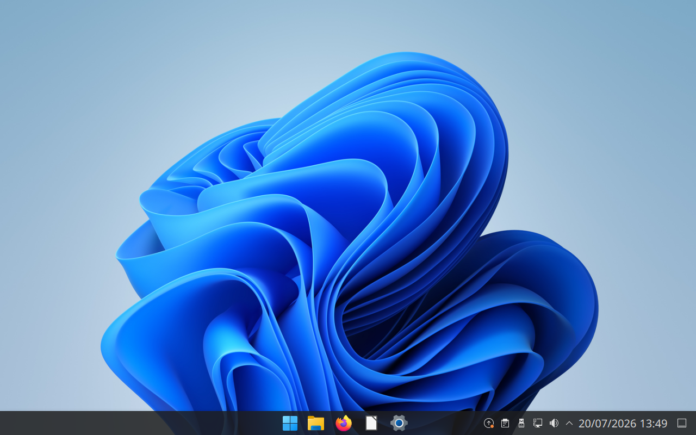
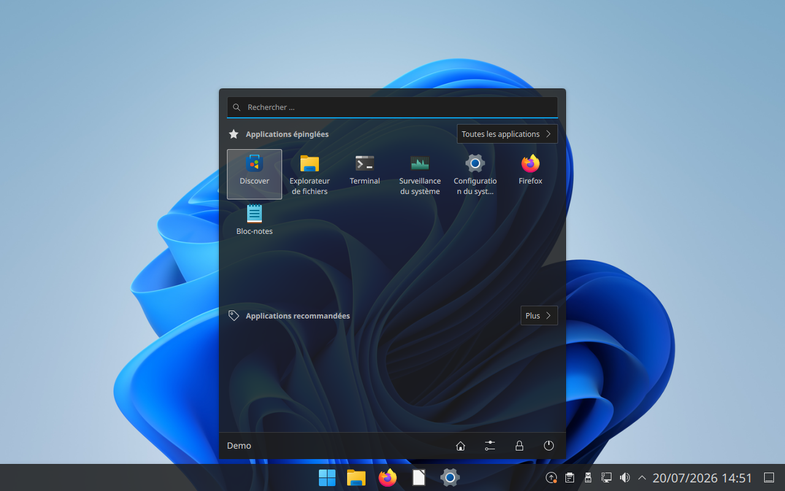
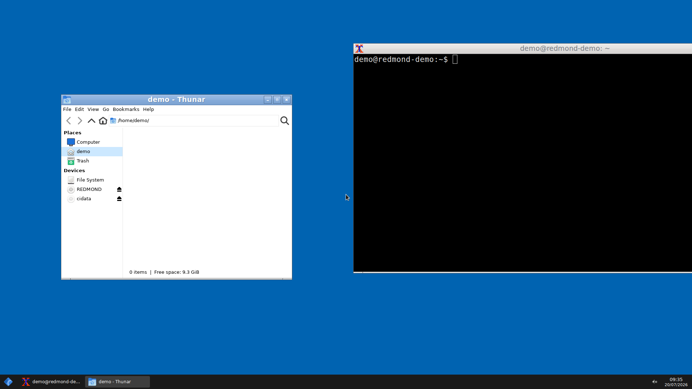

# DejaVu Desktop

Un bureau Linux qui imite l'apparence de Windows — barre des tâches, menu Démarrer, thème et raccourcis familiers. *Vous connaissez déjà cet écran.*

**Public visé** : les personnes qui migrent de Windows vers Linux et veulent retrouver leurs repères immédiatement.

## À quoi ça ressemble

**Édition Familiale (KDE)** — bureau complet façon Windows 11 :



Le menu Démarrer, avec recherche et applications épinglées :



**Édition Lite (Openbox)** — la même promesse pour les vieux PC :



## Deux éditions

| Édition | Script | Base | Pour qui |
|---|---|---|---|
| **Lite** (Openbox) | `./install.sh` | Debian/Ubuntu minimal + Openbox/tint2/jgmenu | Vieux PC, machines Windows 10 en fin de support (~300 Mo RAM) |
| **Familiale** (KDE) | `./install-kde.sh` | Ubuntu/Kubuntu + KDE Plasma | Usage quotidien complet (paramètres, Wi-Fi, imprimantes intégrés) |

L'édition familiale transforme Plasma en quasi-Windows 11 (recette validée sur Ubuntu 24.04) :
- thème global **Win11OS** + icônes **Win11** (yeyushengfan258) + fond d'écran Bloom
- **menu Démarrer Windows 11** (plasmoïde OnzeMenu : recherche, applications épinglées/recommandées)
- **barre des tâches centrée** avec applications épinglées (explorateur, Firefox, terminal, paramètres)
- décorations de fenêtres Win11, **double-clic pour ouvrir**, écran de connexion SDDM thémé
- **bureautique incluse** : LibreOffice (fr), Okular (PDF), Gwenview (images), Ark (archives), Kate, calculatrice — et Firefox épinglé avec la bonne icône

Captures (VM Debian 12 pour Lite, VM Ubuntu 24.04 pour KDE) : voir [docs/screenshots/](docs/screenshots/).

## Notes VM / matériel

- Dans une VM sans GPU : picom doit passer en backend `xrender` (édition Lite).
- Les images cloud Debian/Ubuntu utilisent un noyau allégé **sans pilotes DRM** : installer `linux-generic` (Ubuntu) ou `linux-image-amd64` (Debian) pour l'affichage virtio/qxl.
- Préférer un display manager (LightDM/SDDM) à `startx` lancé par systemd.

## Composants

| Rôle | Outil |
|---|---|
| Gestionnaire de fenêtres | Openbox |
| Barre des tâches (+ zone de notification, horloge) | tint2 |
| Menu Démarrer | jgmenu |
| Effets (ombres, transparence) | picom |
| Fond d'écran | feh |
| Thème GTK + icônes | B00merang Windows-10 |
| Gestionnaire de fichiers | Thunar |
| Réseau / volume / notifications | nm-applet, volumeicon, dunst |

## Installation

Distributions supportées : **Debian 12+, Ubuntu 22.04+** (et dérivées).

```bash
git clone https://github.com/Courouge/dejavu-desktop.git
cd dejavu-desktop
./install.sh
```

Puis se déconnecter et choisir la session **Openbox** sur l'écran de connexion.

## Raccourcis clavier (identiques à Windows)

| Raccourci | Action |
|---|---|
| `Super` | Menu Démarrer |
| `Super + E` | Explorateur de fichiers |
| `Super + D` | Afficher le bureau |
| `Super + L` | Verrouiller l'écran |
| `Super + ←/→` | Ancrer la fenêtre à gauche/droite |
| `Alt + Tab` | Changer de fenêtre |
| `Alt + F4` | Fermer la fenêtre |

## Personnalisation

- Barre des tâches : `~/.config/tint2/tint2rc`
- Menu Démarrer : `~/.config/jgmenu/jgmenurc`
- Raccourcis / fenêtres : `~/.config/openbox/rc.xml`
- Fond d'écran : placer une image dans `~/.config/dejavu/wallpaper.jpg`
- Apparence GTK : lancer `lxappearance`

## Désinstallation

```bash
./uninstall.sh
```

Restaure les configurations sauvegardées (`*.dejavu-backup`).

## Marques

Projet indépendant, non affilié à Microsoft. Aucune ressource propriétaire (icônes, polices, logos Windows) n'est distribuée : seuls des thèmes libres d'inspiration similaire sont utilisés.
